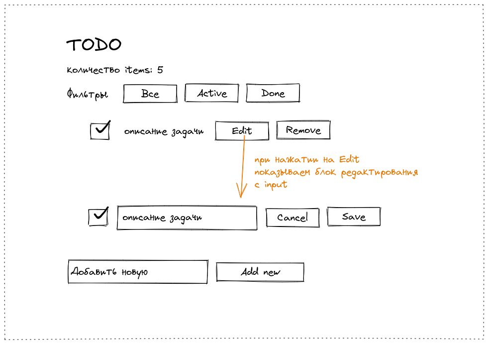

# Простой TODO-лист

Тестовый проект, базовая работа с Angular, передача данных между компонентами

## Техническое задание

* Angular, SCSS
* Простой список задач, отдельный компонент для `item`
* Передача данных между компонентами с помощью `@Input` and `@Output`
* Возможность редактировать и удалять задачи
* Фильтр задач по состоянию (все, активные, выполненные)

Примерная схема приложения на рисунке:

## Feedback

Email: dmitriy.tka4@gmail.com
